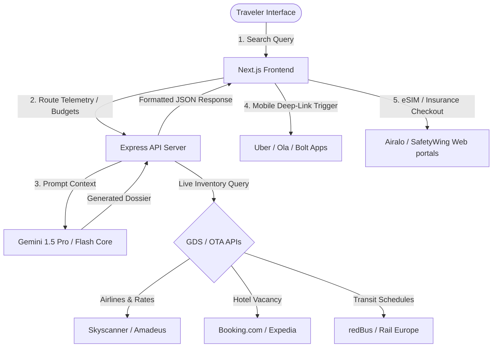
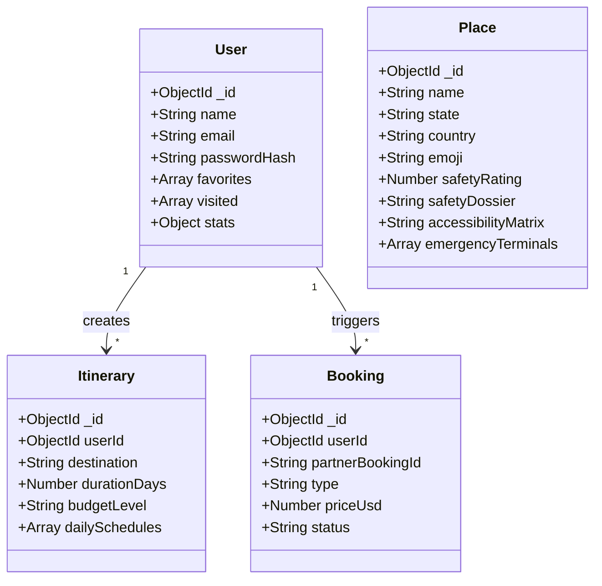

# Let's Travel World — Ultimate Startup Blueprint
## Production Architecture, Integration Protocols, & Business Strategy

This single implementation file contains the comprehensive, step-by-step technical blueprints, flowcharts, data schemas, and financial models for launching **Let's Travel World** as a premium travel super app.

---

## 🗺️ System Data Flow & API Routing

The following diagram illustrates how the frontend, Express backend, AI Core, and external partners orchestrate queries and transactions.

---

## 📊 Startup Monetization Grid

This table details the integration partners, commission margins, and pricing setups across all transaction segments.

| Travel Segment | Target Provider | Revenue Mechanism | Average Margin | Premium Tier Benefit |
| :--- | :--- | :--- | :---: | :--- |
| **Flights** | Skyscanner APIs / Amadeus | Affiliate Link Commission | 1% – 3% | Real-time AI Price Drop Alerts |
| **Stays (Hotels/Homestays)** | Booking.com / Expedia Group | Booking Commission | 8% – 12% | Cashback Loyalty Rewards |
| **Ground Transit (Bus/Train)** | redBus / Rail Europe | Ticketing Commission | 4% – 6% | Automated Multi-modal Routing |
| **Local Activities & Tours** | Viator / GetYourGuide | Ticket Commission | 10% – 15% | Curated Local Host Recommendations |
| **eSIM Card Sales** | Airalo / Holafly | Affiliate Commission | 15% – 20% | Auto-detection on arrival |
| **Travel Insurance** | SafetyWing / World Nomads | Lead Commission | 10% – 15% | Integrated checkout in-app |
| **SaaS Dashboard (Enterprise)** | Custom B2B Employee Dashboard | Tiered Subscription | $15/seat/mo | Automatic Expense PDF auditing |

---

## 🗄️ Database Schema & Telemetry Architecture

This database schema is structured for MongoDB and maps all essential dimensions to compile the ultimate travel OS datasets.

---

## 📱 Mobile Deep-Linking Protocols

Instead of implementing custom booking engines for ride-hailing services, the frontend uses native mobile OS URL schemes to launch the local taxi provider with coordinates pre-filled.

| Provider | Operating Scheme URL Template | Expected Behavior |
| :--- | :--- | :--- |
| **Uber** | `uber://?action=setPickup&pickup=my_location&dropoff[latitude]={lat}&dropoff[longitude]={lng}&dropoff[nickname]={name}` | Launches Uber app, sets pickup at GPS location, drop-off at destination, initiates fare comparison. |
| **Ola** | `olacabs://app/launch?lat={lat}&lng={lng}&utm_source=lets_travel` | Opens Ola app, pre-fills drop-off coordinates. |
| **Bolt** | `bolt://app/ride?pickup=current&dropoff_lat={lat}&dropoff_lng={lng}` | Opens Bolt app, sets destination pin. |
| **Rapido** | `rapido://booking?lat={lat}&lng={lng}&type=bike` | Launches Rapido bike taxi booking flow in India. |

---

## 🛠️ Step-by-Step Production Roadmap

### Step 1: Live API Inventory Onboarding
- **Skyscanner / Amadeus**: Replace simulated flight dossiers with direct API query responses.
- **Booking.com**: Pull live room categories, prices, star ratings, and cancellation policies.

### Step 2: AI Price Predictor Deployment
- Track flight price histories in your database.
- Deploy an AI price-prediction model to output Buy/Wait recommendations based on seasonal ticket price indexes.

### Step 3: Global eSIM & Insurance Checkouts
- Integrate affiliate referral programs for **Airalo eSIMs** and **SafetyWing Travel Insurance** to earn commission fees from within the itinerary pages.

### Step 4: Corporate SaaS Employee Dashboards
- Deploy a portal where enterprise companies can coordinate corporate trips, track employee travel budgets, and generate PDF audit logs automatically.
